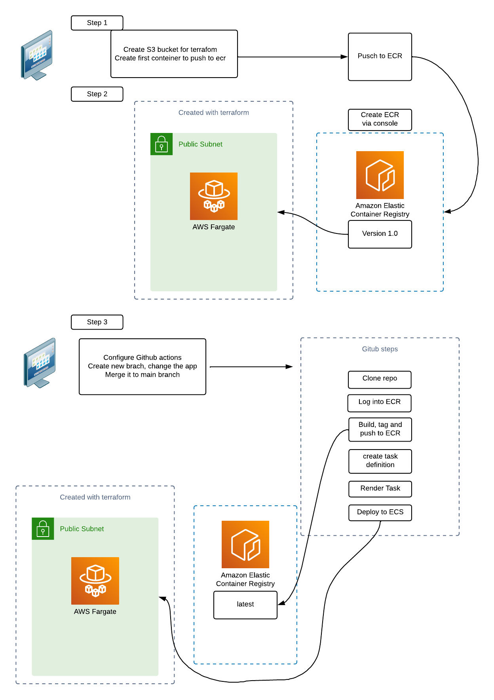

# Create a simple ECS schema with Terraform and deploy new app version container via Github Actions
To make this project work, you need:

- An AWS account where all resources will be deployed
- Terraform installed in you pc

Project structure:

 - **infra**:  Terraform files in which all resources are defined
 - 
 - **app**: a simple node.js  app with its Dockerfiles, which is used to create the container that is uploaded to ECR

### Step 1 Create ECR registry and upload the first container

First we need to create a ECR repository to upload the ECR container. We can use the web console or use AWS cli:

 ```aws ecr create-repository --repository-name ECR-REPO --region REGION ```
    
    
After getting the ECR uri to upload the file to the registry, after tagging the image

 ```docker tag app_container:v1.0 1234567890.dkr.ecr.us-east-1.amazonaws.com/hado-ecr ```
 
 Log into the registry

 ``` aws ecr get-login-password --region us-east-1 | docker login --username AWS --password-stdin 1234561890.dkr.ecr.us-east-1.amazonaws.com/hado-ecr ```

Push the image

 ```docker push 1234567890.dkr.ecr.us-east-1.amazonaws.com/hado-ecr ```


### Step 2 - Create the infra via terraform

On the infra folder we have the following files

| **file**       | **usage**                                                    |
|----------------|--------------------------------------------------------------|
| remote-state.tf| Configuration for s3 bucker + dynamodb terraform state file  |
| network.tf     | VPC, public subnet, IG, RT and other network configuration   |
| provider.tf    | AWS provider configuration                                   |
| variables.tf   | porject variables definition. If not updated use AWS default profile |
| ecs.tf         | ECS cluster, task, service definition                        |

To perform the resources creation you need to run the follwing commands palced inside the infra forlder

 ```terraform init ```
 
 ```terraform plan ```
 
 ```terraform apply ```
 
It's importat to be aware that the values for AWS account configuration shuñd be updated if they differ from the default account

After applying the terraform we should get:
- A VPC 
- A public subnet
- A ECR cluster named as in the ecr.tf file with 1 task and 1 service already deployed
- A Security group allowing access to port 3000 
- A S3 bucket for terraform state file
- A DynamoDB schema for locking the file

### Configure the repo to allow Github to deploy a new app version

With the ECS service up and running we can configure an action to deploy a new container each time a merge is done in the main branch.

In order to do this we will need to configure a few secrets in the repository. It's best recomendend to create an specific user to deploy this project and give them the minimun permissions to just create a task and a service for the cluster.

Before running the Action we will need the following assets under the repository configurations:

| **Parameter**         | **type** | **Value**                                         |
|-----------------------|----------|---------------------------------------------------|
| ACCOUNT_ID            | secret   |  AWS accont ID for the cluster                    |
| AWS_ACCESS_KEY_ID     | secret   | CLI access key ID for the user to update the task |
| AWS_SECRET_ACCESS_KEY | secret   | CLI secret key ID for the user to update the task |


A quick look at the file `.github/workflows/actions.yaml` gives an overview of the steps:

***note: check the values for the env values for ECR_REPOSITORY and AWS_REGION***

1- Check out the repo

2- Configure AWS credentials

3- Login to Amazon ECR

4- Build, tag, and push image to Amazon ECR

5- Download task definition to be updated

6- Render Amazon ECS task definition

7- Deploy the service (check the values for service and cluster to match terraform configuration)

The trick to just run it on merge on main branch is done via the fisrt part on the yml and the condition on the job.

Another workaround would be to block merge request to main under approval via a rule.




#### TODO:

- Create the user for this project IAM via terraform or replace it for an IAM identity provider (OpenID Connect), a role and a policy to enable trust between AWS account and GitHub Action for the org/repo/branch. 
- Update the github actions using the new schema of passing data between steps  ```echo "::set-output name=image::$ECR_REGISTRY/${{ env.ECR_REPOSITORY }}:$IMAGE_TAG" ```.
 